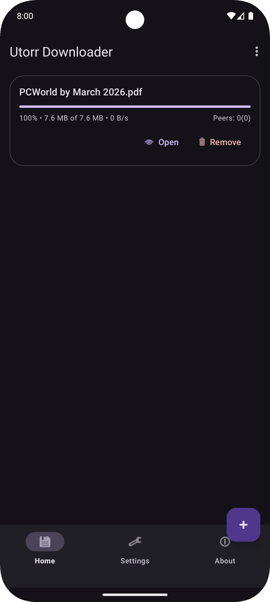

# Utorr Downloader

Utorr is a fast, simple, and efficient torrent downloader for Android. It combines a powerful Go-based engine with a modern Kotlin-based UI to provide a seamless downloading experience.

## Features

- **Magnet Link Support:** Easily add downloads using magnet links.
- **Torrent File Support:** Open and download from `.torrent` files.
- **Background Downloading:** Downloads continue in the background via a foreground service with notification support.
- **Manage Downloads:** Pause, resume, and remove torrents individually or all at once.
- **Customizable Settings:** 
  - Change download directory.
  - Configure maximum peer connections.
  - Choose between Light, Dark, or System Default themes.
- **Material Design:** A clean and intuitive interface built with Material 3.

## Technologies Used

- **Android (Kotlin):** Modern UI development using View Binding and Navigation Component.
- **Go (Golang):** High-performance torrent engine (located in `engine/utorr`).
- **Material Design 3:** Modern look and feel.
- **GitHub Actions:** Automated release workflow.

## Getting Started

### Prerequisites

- Android Studio Jellyfish or newer.
- JDK 17.
- Android SDK 34 or higher.

### Building

1. Clone the repository:
   ```bash
   git clone https://github.com/izzyjere/utorr.git
   ```
2. Open the project in Android Studio.
3. Build the project:
   ```bash
   ./gradlew assembleDebug
   ```
4. Run the app on an emulator or a physical device.
5. Demo


## Contributing

Contributions are welcome! Please feel free to submit a Pull Request.
---
*Note: This app is for educational purposes. Please use it responsibly and respect copyright laws.*
